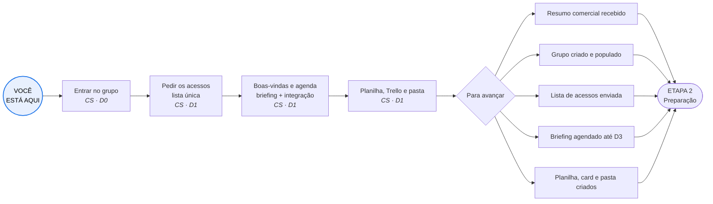
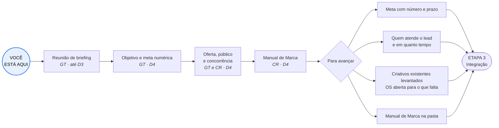
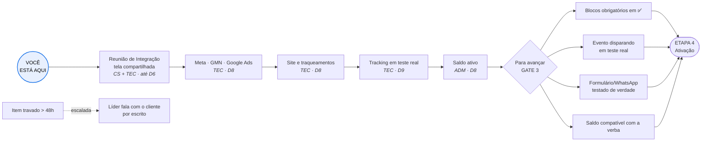
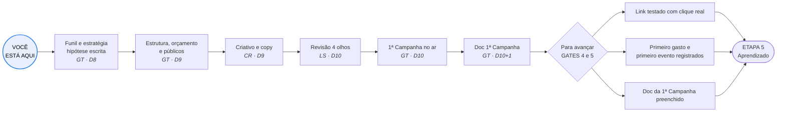
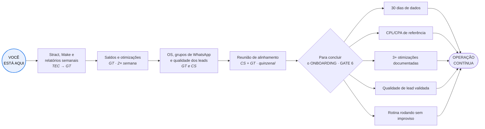
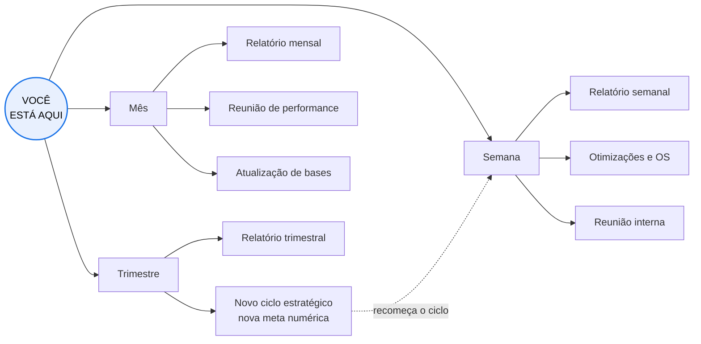
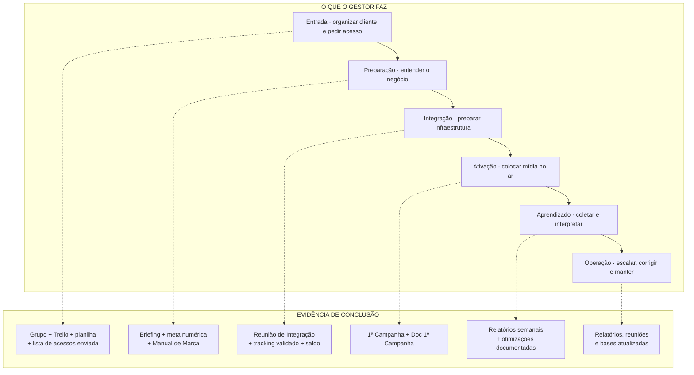
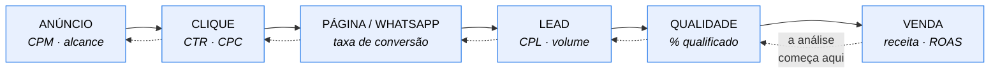
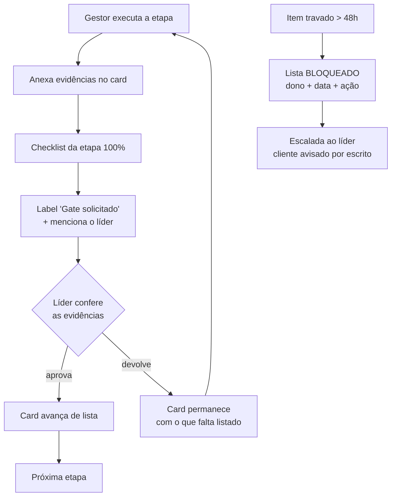

# 07 — Fluxograma Progressivo

> Diagramas em Mermaid — renderizam no GitHub, no Notion e em qualquer editor
> Markdown moderno. Servem de fonte para a versão desenhada (Canva/Figma).
>
> **Versão navegável, etapa a etapa:** https://claude.ai/artifact/8xE8xNz6U7jBhyr5JN5STD

---

## 1. Visão macro — o fluxo oficial com marcos e gates

```mermaid
flowchart LR
    K([KICKOFF]) --> F1

    subgraph F1["1 · ENTRADA"]
        direction TB
        A1[Entrada no grupo] --> A2[Acesso<br/>lista única] --> A3[Contato e agenda] --> A4[Planilha e Trello]
    end
    F1 --> M1{{"MARCO D1<br/>Pós Kickoff"}} --> F2

    subgraph F2["2 · PREPARAÇÃO"]
        direction TB
        B1[Briefing] --> B2[Objetivo e meta] --> B3[Oferta · público<br/>concorrência] --> B4[Manual de Marca]
    end
    F2 --> M2{{"MARCO D4<br/>Manual de Marca<br/>ENTRA FLOWFORMANCE"}} --> F3

    subgraph F3["3 · INTEGRAÇÃO"]
        direction TB
        C1[Reunião de Integração] --> C2[Meta · GMN · Google Ads]
        C2 --> C3[Site e traqueamentos] --> C4[Tracking em teste real] --> C5[Saldo]
    end
    F3 --> G3{{"GATE 3<br/>integrações validadas"}} --> F4

    subgraph F4["4 · ATIVAÇÃO"]
        direction TB
        D1[Funil] --> D2[Criativo e copy] --> D3[Revisão 4 olhos] --> D4[1ª Campanha] --> D5[Doc 1ª Campanha]
    end
    F4 --> M3{{"MARCO D10<br/>Acessos e Integração<br/>+ 1ª Campanha"}} --> F5

    subgraph F5["5 · APRENDIZADO · 30 dias"]
        direction TB
        E1[Stract · Make<br/>relatórios semanais] --> E2[Saldos e otimizações]
        E2 --> E3[OS · grupos<br/>qualidade dos leads] --> E4[Reunião de alinhamento]
    end
    F5 --> G6{{"GATE 6<br/>fim do onboarding"}} --> F6

    subgraph F6["6 · OPERAÇÃO CONTÍNUA"]
        direction TB
        H1[Relatórios mensais] --> H2[Reunião de performance]
        H2 --> H3[Atualização de bases] --> H4[Reunião interna] --> H5[Relatório trimestral<br/>novo ciclo]
    end
    H5 -.->|novo ciclo estratégico| F5

    classDef marco fill:#fff3cd,stroke:#b8860b,stroke-width:2px,color:#000;
    class M1,M2,M3,G3,G6 marco;
```

---

## 2. Fluxograma progressivo — uma etapa por vez

O formato acima é a arquitetura. O formato abaixo é o que o gestor júnior usa:
**onde estou · o que faço agora · o que destrava a próxima etapa.**

### Etapa 1 · ENTRADA — Pós Kickoff D1

### Etapa 2 · PREPARAÇÃO — Manual de Marca D4

### Etapa 3 · INTEGRAÇÃO — Acessos e Integração D10

### Etapa 4 · ATIVAÇÃO — 1ª Campanha D10

### Etapa 5 · APRENDIZADO — 30 dias

### Etapa 6 · OPERAÇÃO CONTÍNUA — D40+

---

## 3. Camada do gestor — fase · ação · evidência

---

## 4. O sistema de aquisição — base do diagnóstico

> Otimizar o Gerenciador é mexer só nas duas primeiras caixas. O resultado do
> cliente mora nas últimas quatro.

---

## 5. Fluxo de aprovação de um gate

---

## 6. Para a versão desenhada

Ao levar para Canva/Figma, manter **exatamente**:

- os nomes dos marcos oficiais: `Pós Kickoff D1`, `Manual de Marca D4`,
  `Entra Flowformance`, `Acessos e Integração D10`, `1ª Campanha D10`,
  `Aprendizado 30 dias`;
- a ordem do fluxo oficial (grupo → acesso → contato/agenda → planilha/Trello →
  Reunião de Integração → saldo → funil → criativo → 1ª campanha → doc…);
- os gates como portas, visualmente diferentes das etapas;
- o bloco "para avançar" em cada etapa — é ele que responde "posso seguir?";
- as cores de status iguais às labels do Trello (🟢 🟡 🔴).

Se o desenho usar outro vocabulário, o sistema volta a depender de memória — que é
exatamente o que ele existe para eliminar.
