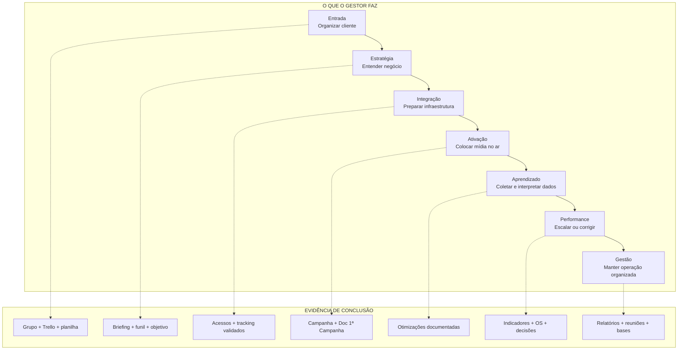
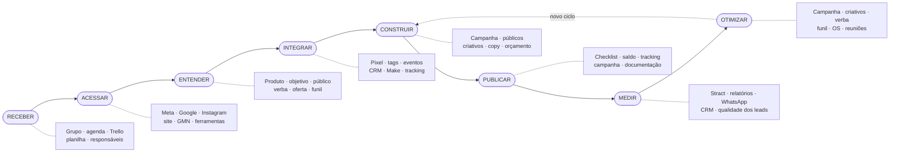
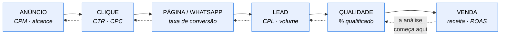
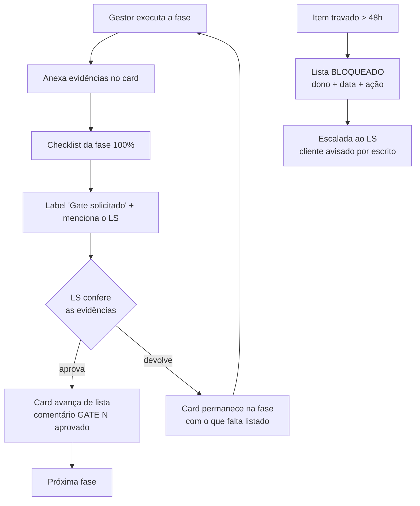

# 07 — Fluxograma Visual (3 camadas)

> Diagramas em Mermaid — renderizam no GitHub, no Notion e em qualquer editor
> Markdown moderno. Servem de fonte para a versão desenhada (Canva/Figma) usada
> no treinamento.

---

## 1. Visão macro — fases, marcos e gates

```mermaid
flowchart LR
    subgraph F1["1 · ENTRADA<br/>D0–D1"]
        A1[Kickoff] --> A2[Grupo + squad] --> A3[Planilha + Trello + pasta]
    end
    subgraph F2["2 · PREPARAÇÃO<br/>D1–D4"]
        B1[Briefing] --> B2[Objetivo + PUV + público] --> B3[Funil + Manual de Marca]
    end
    subgraph F3["3 · INTEGRAÇÃO<br/>D4–D10"]
        C1[Acessos] --> C2[Pixel / GTM / GA4] --> C3[Eventos + saldo validados]
    end
    subgraph F4["4 · ATIVAÇÃO<br/>até D10"]
        D1[Estratégia + estrutura] --> D2[Criativos + copy] --> D3[Revisão → publicação → doc]
    end
    subgraph F5["5 · APRENDIZADO<br/>D10–D40"]
        E1[Acompanhar entrega] --> E2[Ler indicadores] --> E3[Otimizar + documentar]
    end
    subgraph F6["6 · OPERAÇÃO CONTÍNUA<br/>D40+"]
        G1[Relatórios] --> G2[Reuniões + OS] --> G3[Ciclo trimestral]
    end

    F1 --> GT1{{"GATE 1<br/>Cliente recebido<br/>MARCO D1"}} --> F2
    F2 --> GT2{{"GATE 2<br/>Estratégia definida<br/>MARCO D4"}} --> F3
    F3 --> GT3{{"GATE 3<br/>Integrações validadas"}} --> F4
    F4 --> GT4{{"GATE 4<br/>Pronto p/ campanha"}} --> GT5{{"GATE 5<br/>Campanha publicada<br/>MARCO D10"}} --> F5
    F5 --> GT6{{"GATE 6<br/>Aprendizado concluído<br/>FIM DO ONBOARDING"}} --> F6

    classDef gate fill:#fff3cd,stroke:#b8860b,stroke-width:2px,color:#000;
    class GT1,GT2,GT3,GT4,GT5,GT6 gate;
```

---

## 2. Camada do gestor — fase · ação · evidência

---

## 3. Camada do treinamento — os 8 verbos

---

## 4. O sistema de aquisição (base do diagnóstico)

> Otimizar o Gerenciador é mexer só nas duas primeiras caixas. O resultado do
> cliente mora nas últimas quatro.

---

## 5. Fluxo de aprovação de um Gate

---

## 6. Para a versão desenhada

Ao levar isto para Canva/Figma, manter **exatamente**:

- os nomes das 6 fases (iguais aos das listas do Trello);
- os 3 marcos em destaque (D1, D4, D10) e o D40 como fim do onboarding;
- os 6 Gates como portas, visualmente diferentes das etapas;
- a linha dos 8 verbos como faixa inferior do diagrama;
- as cores de status iguais às labels do Trello (🟢 🟡 🔴).

Se o desenho usar outro vocabulário, o sistema volta a depender de memória — que
é exatamente o que ele existe para eliminar.
